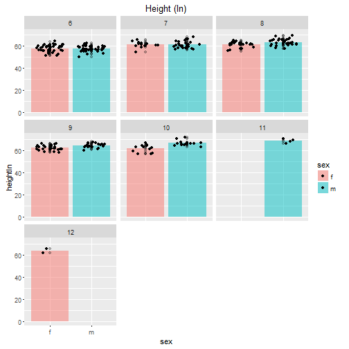
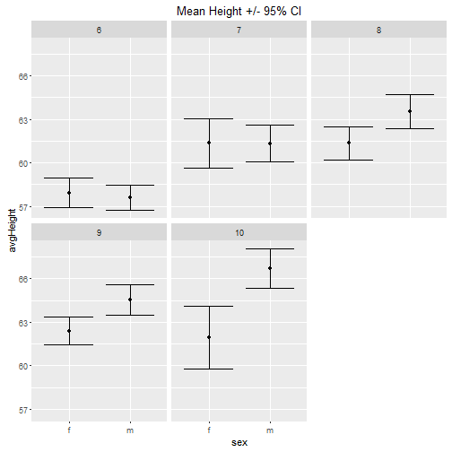
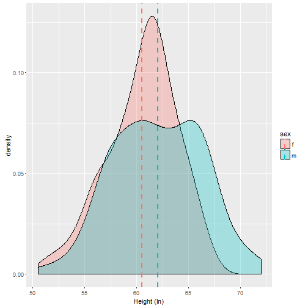

Exploring the height and weight of grade school children
========================================================
author: Rob Rolleston
date: Developing Data Products: 2016-April
width: 1024
height: 768

Motivation & Data
========================================================

## At what grade do the heights and weights of boys and girls become statistically different?

The original data for this exploration comes from the __gcookbook::heightweight__ data set within the <https://cran.r-project.org/web/packages/gcookbook/index.html> package.


The data consists of 236 observations of

- sex (factor with levels: f, m)
- ageYear (range: 11.58, 17.5)
- ageMonth (range: 139, 210)
- heightIn (range: 50.5, 72)
- weightLb (range: 50.5, 171.5)

Data Preparation
=========================================================
The fields `ageMonth` and `ageYear` are redundant. and instead of using either of these , a new variable was created: 'grade'

```r
data$grade <- as.factor(round(data$ageYear) - 6)
```
This was used as approximation to the true grade, and will become the primary factor in the analysis for looking at age differences.

In addition, the _Standard Error_ and _95% Confidence Interval_ were calculated for each grade by sex.


Exploring Height by Sex
=========================================================
left: 60%

Shown on the right are bar plots of the average Height(In) for each grade, for each sex along with a jittered set of data points.  Two observation are made:

1. Because of missing data, grades '11' and '12' will not be used
2. At this scale there is very little visible difference in the average height for each grade.

A proper statistical _t_-test will be used to examine differences in these means.

***


Mean Height and Density Function
=========================================================
left: 40%

A plot of the mean, with 95%CI indicate there are likely statistically significant differences at the higher grades.



***

Application will allow exploration of Density Functions & Means by grade. <http://robrolleston.shinyapps.io/RobRolleston_DDP_2016-April/> along with the calcuated _p_-value of the _t_-test.


